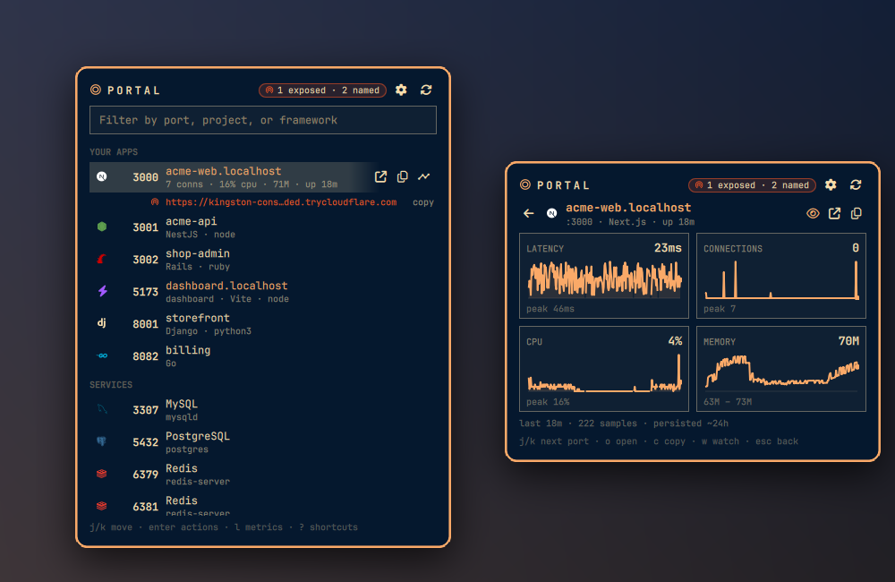

# Portal

[](https://github.com/g3ortega/omarchy-portal/actions/workflows/ci.yml)

Every listening port on your machine, what's running on it, and one key to
open, name, share, pause, restart or stop it. An [Omarchy](https://omarchy.org)
bar plugin.

<p align="center">
  
</p>

```sh
omarchy plugin add https://github.com/g3ortega/omarchy-portal.git --enable
omarchy bar move g3ortega.portal --section right
```

Bind it to a key (pick one that's free in `omarchy menu keybindings --print`):

```lua
-- ~/.config/hypr/bindings.lua
o.bind("SUPER + ALT + P", "Portal", "omarchy-shell g3ortega.portal toggle")
```

Remove with `scripts/portal uninstall` first (it disables the plugin, stops
every share and name Portal created, drops the Portless CA from the browser
stores Portal added it to, deletes cloudflared if it is still Portal's copy,
and removes Portal's state), then `omarchy plugin remove g3ortega.portal`.

Portal talks to: `localhost` ports it lists (latency probes), the local
Portless proxy and ngrok agent, `1.1.1.1` or `dns.google` over HTTPS to
confirm a fresh tunnel hostname exists, and GitHub for the pinned cloudflared
release you ask it to install. Nothing else.

## What it does

- Finds every listening TCP port with a couple of `ss` calls and names the
  stack behind it (nearly 50: Next, Vite, Rails, Django, Phoenix, Go,
  Postgres, Redis, ...).
- Gives a port a local name like `https://acme-web.localhost` through
  [Portless](https://github.com/vercel-labs/portless). Nothing leaves the machine.
- Shares a port publicly through Cloudflare or ngrok, and paints anything
  public in your theme's urgent color so you can't forget it's open.
- Charts latency, connections, CPU and memory per port. Watch a port to keep
  a day of samples (at the default 5-second scan).
- Pauses, resumes, restarts and stops a dev server. The loud ones ask first.
- Works entirely from the keyboard. Press `?` in the panel.

Settings live in the panel (`,`). Listing and sharing are also a CLI
(`scripts/portal`) and an IPC target (`omarchy-shell g3ortega.portal`).

Details, screenshots, settings, CLI, security notes and how to hack on it:
[docs/guide.md](docs/guide.md).

MIT. See [LICENSE](LICENSE).
