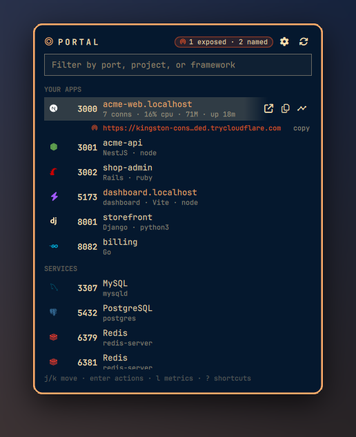
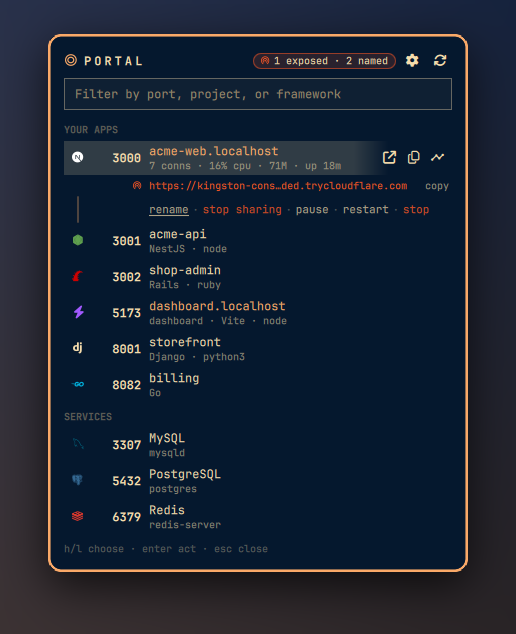
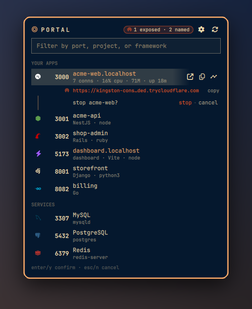
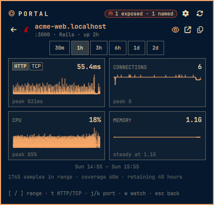
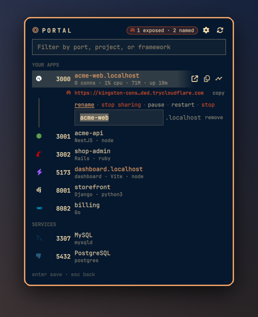
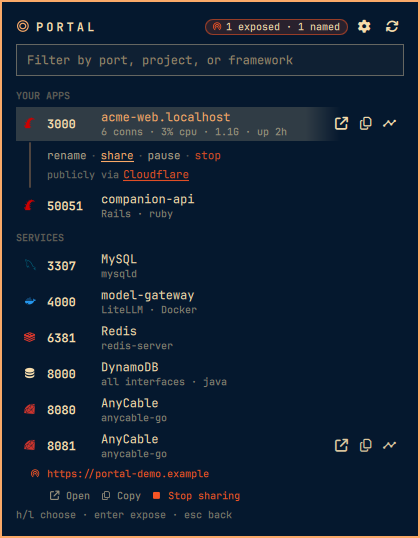
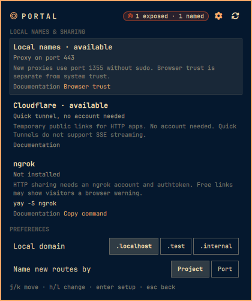
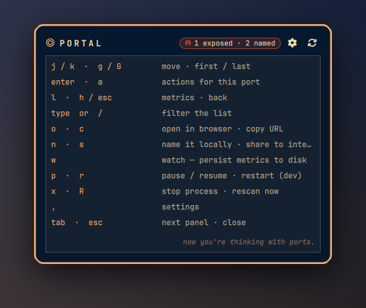

# Portal guide

## The list



Every few seconds two `ss` calls list the TCP listeners and their established
peers. Ports are grouped into your apps, services, and system ports (hidden
by default). Detection reads the process command line, the
working directory's project markers, and an allowlisted set of `package.json`
dependencies, so a bare `node` process is listed as Next.js, Vite or Nest
instead of "node". A dev server that disappears between scans raises a
desktop notification.

Stacks recognized: Next.js, Nuxt, Astro, SvelteKit, Angular, Vite,
Storybook, React Router (Remix), NestJS, React, Vue, Hono, SolidStart,
Express (also Fastify, Koa, Hapi), Deno, Bun, Node, Rails, Sidekiq, AnyCable,
Ruby, Django, FastAPI, Flask (also Gunicorn), Jupyter, Streamlit, Python,
Phoenix, Laravel, PHP, Go, Rust, .NET, Java, PostgreSQL, MySQL (also
MariaDB), Redis (also Valkey), OpenSearch (also Elasticsearch), MongoDB,
DynamoDB Local, RabbitMQ, Kafka, Mailpit and MailHog, MinIO, Docker. Portal's
own proxy and tunnel processes, DNS, printing and SSH land in the system
group.

## Actions




A row shows open, copy and charts on hover. Click it (or press Enter) and it
unfolds a line of verbs: name, share, pause, restart, stop. Pause is SIGSTOP.
Restart re-runs the process's own argv in its own directory and environment.
A server started through mise, nvm, or a shell hook uses the same launcher.
Signals only go to processes you own. Stop, pause, and restart ask first and
name the process. Resume never asks.

Prefork servers (a puma cluster, gunicorn workers) show the first pid the
kernel lists for the port, which may be a worker rather than the master;
pause, restart and stop act on that pid.

## Charts



The chart icon (or `l`) opens latency, connections, CPU and memory over time.
Every port keeps 720 samples in memory, an hour at the default 5-second
scan. Watch a port and 17280 samples persist across shell restarts, a day at
the default. An area fill is drawn only
from a true zero baseline, so zero connections sits on the floor and reads
"no connections". A value that never moves says "steady at 21M" rather than
inventing a shape. Hovering any card reads all four out at that instant.

## Local names



Name a port and it becomes `https://acme-web.localhost` through Portless. The
name is the row's title, and it is what opens and what copies. In the name
editor, Enter on an empty field removes the name.

Portless needs its proxy on port 443 (or 80) for clean names, and it self-elevates
through sudo to bind it. An elevated proxy defaults to root's state directory
and silently 404s your routes. The fix Portal hands you pins
`PORTLESS_STATE_DIR` to your home, which portless forwards through its own
sudo. Portal never runs sudo for you. It shows the command and you paste it.

## Sharing



| Provider | Reach | URL | Needs |
|---|---|---|---|
| Cloudflare | public | `https://<words>.trycloudflare.com` | nothing; a confirmed click installs a checksum-pinned release |
| ngrok | public | `https://<id>.ngrok-free.app`, or your reserved domain | `ngrok` and an authtoken |
| Portless | this machine | `https://<name>.localhost` | `portless`, proxy on 443 |

Providers are detected, not assumed. Each shows ready, needs setup (with a
fix where one exists), or not installed. Sharing asks first, in place, naming the
port and the provider, and a desktop notification confirms every new public
URL, whether the panel or IPC asked for it. A fix that puts something
on the machine asks too: installing cloudflared names the release and the
directory; setting up local names says it will trust your Portless CA in
Chrome and Firefox and start the proxy. Anything reachable from
the internet is drawn in the theme's urgent color in the row, in the panel,
and on the bar.

A new public hostname is held back until its DNS record is live, checked
through a resolver outside your system's path so the check itself cannot
poison your resolver's cache. If it is still not resolvable after that, the
row shows the URL dimmed with "waiting for dns…" and turns into a link on the
poll it resolves.

When the approved process closes its port, the tunnel remains for ten minutes
in case that same process reopens it. The row reads "shared while nothing
listens" and offers only stop sharing. A different process binding the port
stops the tunnel on the next poll instead of inheriting the public URL.

Portal also adopts what you already run: routes created with the `portless`
CLI, cloudflared quick tunnels you started in a terminal, and tunnels on
ngrok's local agent. The agent is expected on port 4040; set `NGROK_API_PORT`
in the shell's environment if yours uses another `web_addr`.

## Settings



The gear (or `,`) opens every setting in place. They persist to shell.json
through the shell's own API, so `omarchy bar set g3ortega.portal <key> <value>`
works too.

| Key | In the panel | Default | |
|---|---|---|---|
| `portlessTld` | Local domain | `localhost` | Suffix for local names. `localhost` needs zero setup; any other TLD needs a one-time resolver rule, which the panel hands you as a command |
| `portlessAutoName` | Name new routes by | `Project` | Name new routes after the project, or `port-<number>` |
| `showSystemPorts` | System ports | `Off` | Include DNS, printing, SSH, and Portal's own proxy and tunnel processes |
| `iconColors` | Icon colors | `Brand` | Framework colors, or your theme's palette |
| `refreshSeconds` | Rescan every | `5` | Seconds between scans (2 to 120) |
| `barLabel` | Bar label | `Count` | Dev-server count next to the bar icon, or icon only |

Switching the TLD keeps the names you already have: the restart command
unions the new suffix with every one the proxy already serves.

## Keyboard



`j`/`k` (or arrows) move, `g`/`G` jump, Enter (or Space, or `a`) unfolds a
row's verbs and `h`/`l` walk them. Every verb has a direct key: `o` open,
`c` copy, `n` name, `s` share, `w` watch, `p` pause or resume, `r` restart,
`x` stop. `l` opens the charts, `h` comes back, and `j`/`k` walk ports inside
them. `,` opens settings, `R` rescans, `/` focuses the filter and typing
anything else filters too. `y`/`n` answer a confirmation, Esc steps back one
level, Tab moves to the next panel, `?` shows the cheatsheet.

Bind the panel to a key (Omarchy's Lua bindings; pick one that is free in
`omarchy menu keybindings --print`):

```lua
-- ~/.config/hypr/bindings.lua
o.bind("SUPER + ALT + P", "Portal", "omarchy-shell g3ortega.portal toggle")
```

## Terminal and IPC

```sh
scripts/portal                       # list ports (--all includes system)
scripts/portal shared                # active shares
scripts/portal providers             # provider readiness
scripts/portal expose cloudflared 3000
scripts/portal stop cloudflared 3000
scripts/portal stop-all              # every share and name
scripts/portal setup                 # audit and fix the local-names ladder
scripts/portal refresh               # ask the running shell to rescan
scripts/portal doctor                # dependency and install check
scripts/portal test                  # the full non-live gate
```

`list` and `shared` read from the running shell over IPC when it is up and
run the scripts directly when it is down; the rest always run the scripts.

```sh
omarchy-shell g3ortega.portal toggle
omarchy-shell g3ortega.portal refresh
omarchy-shell g3ortega.portal ports          # JSON
omarchy-shell g3ortega.portal tunnels        # JSON
omarchy-shell g3ortega.portal expose cloudflared 3000
omarchy-shell g3ortega.portal unexpose cloudflared 3000
```

`portal setup` hands you the `npm install -g portless` command if Portless is
missing (Portal never runs a package manager), imports your own
Portless CA (`~/.portless/ca.pem`, checked to be Portless's self-signed root,
nothing else) into Chrome, Chromium, Brave and every Firefox profile (needs
`certutil`), and starts an unprivileged proxy if none is running. The one
privileged step, the proxy on 443 pinned to your state, comes back as a
command to paste.

The Cloudflared installer fetches one pinned Cloudflare release from GitHub
into `~/.local/bin`. It verifies the SHA-256 digest and the ELF header before
it installs the file. The reported version is the pinned release version. For
repository signatures, install `cloudflared` with `sudo pacman -S cloudflared`.

## Requirements

`ss`, `jq`, `curl`, `getent`, `setsid`, `notify-send`, `wl-copy`,
`xdg-open`. All ship with Omarchy. `node` is needed only for the tests and
for `scripts/portal` while the shell is down. `portal setup` uses `npm`,
`certutil` and `openssl` when present. Providers are optional.

If `ss` cannot attribute a Node listener, Portal still lists the port. It hides
process actions and public sharing because it cannot bind them to one process.

## Hacking on it

The shell runs the separate checkout at
`~/.config/omarchy/plugins/g3ortega.portal/`. Stage a complete worktree change
before copying it to that checkout.

```sh
git add -A
dev/portal.sh stage
dev/portal.sh parity
dev/portal.sh restart-shell
```

`stage` copies the Git index without pushing and stages the installed clone.
It refuses unstaged or untracked files and requires both checkouts to start at
the same commit. It leaves `.git`, `dev/`, `tmp/`, and `__pycache__/` alone.

Use `dev/portal.sh reload` only for a watcher check. It captures a journal
cursor before touching QML and accepts only a later Portal reload line. Panel
code needs `restart-shell` because the watcher can reuse an existing panel.

Drive the changed path through the installed plugin. Check the journal, IPC
values, and screenshots, then remove every installed-only probe. Run `stage`
and `parity` again. Commit only after that proof passes. Then run
`dev/portal.sh sync`. `sync` checks parity before it pushes, fetches the branch
in the installed clone, merges with `--ff-only`, and checks parity again.

```sh
test/test.sh                 # syntax, manifest, Node and shell suites, qmllint, glyphs
node test/detect.test.mjs    # detection, formatting, panel rules, chart and settings contracts
test/scripts.test.sh         # the shell libraries and validators, against throwaway state
test/check-glyphs.sh         # every icon resolves to the intended glyph name
test/e2e-live.sh             # 19 listener fixtures, plus Ruby and Deno when available
```

CI runs the same suite with `OMARCHY_PATH` pointed at a clone of Omarchy.
These contracts are tests rather than conventions. Every marker or
dependency a detection rule reads has to be collected by `scan-ports.sh`.
Every icon name has to exist in `lib/Icons.js` and resolve to the intended
Nerd Font glyph. Every key in the manifest schema has to have a presentation
in the settings page. The chart axis rules, the panel's mode precedence and
verb availability, and the service's probe order are extracted from the QML
source and run under node, so they cannot drift from what runs.

Adding a framework is one entry in `lib/Detect.js`. Rules are ordered and
the first match wins, so specific rules go before general ones:

```js
{ id: "qwik", label: "Qwik", icon: "node", cat: "dev",
  test: function (e) { return has(e.deps, "@builder.io/qwik") } },
```

A dependency a rule reads must also be in `FRAMEWORK_DEPS` in
`scripts/scan-ports.sh`, or the scanner never collects it; the evidence
contract test fails until it is.

Adding an icon means one line in `lib/Icons.js` with the glyph name in a
trailing comment. `test/check-glyphs.sh` asserts that codepoint still
resolves to that name in the installed font. `U+F0B0E` is in the font, but
it is `md-alpha_g_box`, not `md-broadcast`.

```
manifest.json      service + bar widget, settings schema
Service.qml        scanning, tunnel state, actions, IPC. One instance, not per monitor
BarWidget.qml      bar entry; settings persistence
PortalPanel.qml    the panel: filter, groups, keyboard, modes, footer
PortRow.qml        one port: title, hover bar, verbs, confirmation, editors
PortDetail.qml     the charts page
SparkCard.qml      one chart card and its axis rules
LinkText.qml       the underlined verb
lib/Detect.js      classification rules, pure and unit tested
lib/Icons.js       every glyph, by codepoint, name-verified
lib/Colors.js      brand colors with a contrast floor
lib/Format.js      bytes and uptime formatting
scripts/           scan, tunnels, lifecycle, metrics, setup, installer, CLI
scripts/lib/       portless facts shared by tunnels and setup; the node loader for QML JS
test/              unit tests, shell tests, glyph check, the live farm
```

State lives in the service because bar widgets are instantiated once per
monitor. Polling in the widget would run `ss` twice on a two-screen setup.

## Security

Portal runs unsandboxed inside `omarchy-shell`, like every Omarchy plugin.

- Process names, command lines, paths and URLs are untrusted and rendered
  with `textFormat: Text.PlainText`. QML's default parses HTML and will
  fetch a remote image out of a hostile value.
- Subprocesses take argv arrays. There is no `bash -c` with interpolated
  data. Restart re-executes the exact argv read from `/proc`, carried as
  JSON, refuses a truncated one, and applies the process's environment with
  shell builtins so no value ever appears on a command line.
- The kernel limits signals to processes you own. Lifecycle actions re-check
  both the PID and its kernel start time, then signal through a pidfd. Owned
  tunnel stops use that check for the leader and separately guard process-group
  signals with the recorded command, start time, and `pid > 1`. Adopted
  Cloudflared stops match its current command name and target argument. Adopted
  ngrok stops use the local agent API. Portal never runs sudo.
- Provider output (tunnel logs, the ngrok API, routes files) is untrusted:
  URLs must be a plain `http(s)://host[:port]/...`, TLDs must be DNS labels,
  and ngrok is adopted only from a socket the kernel attributes to your own
  `ngrok`.
- Latency probes hit only ports the service lists: the open charts page,
  watched ports, and detected dev servers, capped at eight per scan.
- `scan-ports.sh` reads an allowlist of marker filenames and dependency
  names, strips control characters, and stops root discovery at directories
  you don't own.
- Metric samples live in XDG state (700/600), hold only numbers and
  timestamps, and are deleted when a port is unwatched. Tunnel state lives
  in `$XDG_RUNTIME_DIR/portal` with the same modes. Every state file, and
  Portless's own state, goes through `scripts/lib/statedir.py`: files are
  opened relative to a verified directory, never through a link, under a byte
  cap, and replaced atomically. A pidfile records the process's kernel start
  time, and the scan carries it for attributed processes. `scripts/lib/proc.py`
  binds lifecycle and owned-leader signals to that PID and start time with a
  pidfd. The separate tunnel stop paths use the guards described above.
  Provider binaries run by absolute path after a regular-file, owner and
  mode check, never by a bare name through PATH.
- Every helper runs under a byte ceiling on its output and a hard deadline
  (`scripts/lib/proc.py`, which ends the whole process group past either and
  passes nothing on); the scanner caps every field, its stderr, and the number
  of ports it will describe (past 512 it reports an error instead); provider
  API bodies and the installer download are byte-capped; every `curl` starts
  with `-q` so a `~/.curlrc` cannot alter the request; a tunnel's log
  is truncated past 4 MiB.
- The Portless CA is imported only when it is a small plain file the user
  owns, is self-signed under Portless's own name, and verifies the
  certificate the live proxy actually presents.
- Portal never touches a provider credential. ngrok reads its own
  authtoken; Portal only reports whether one is configured.
